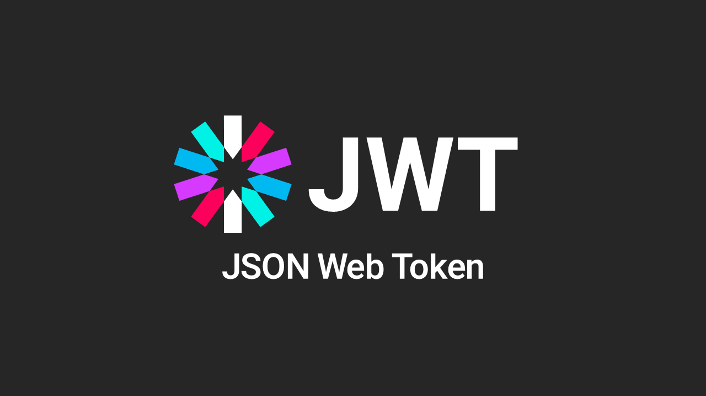
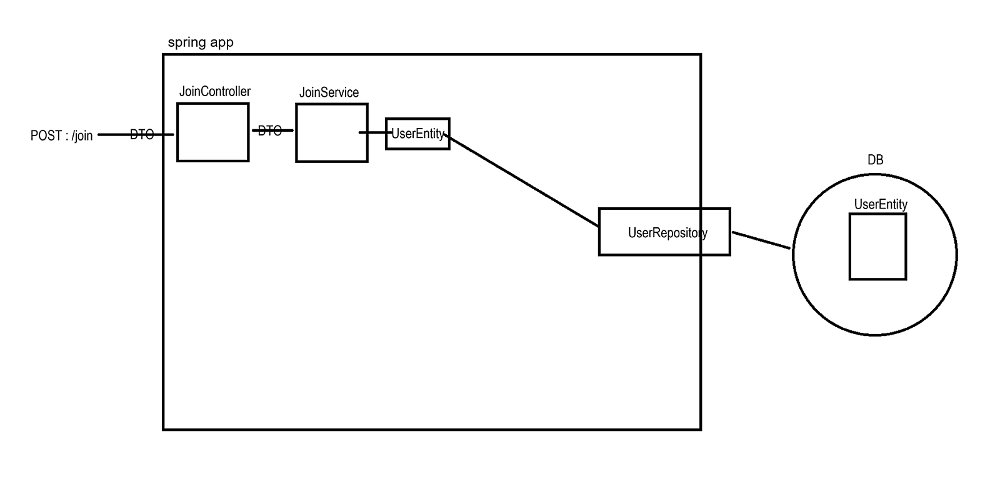
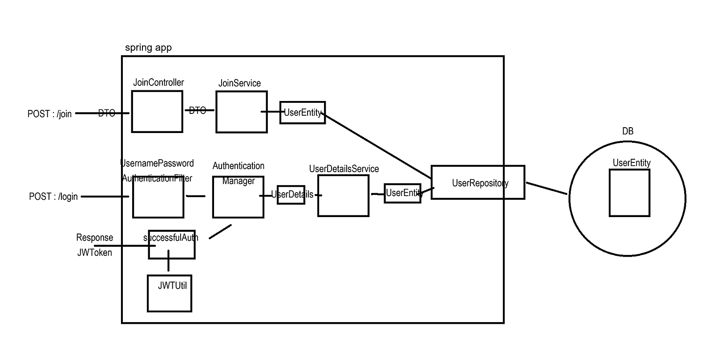

# JWT 인증 흐름



프로젝트의 JWT 기반 인증 처리 흐름을 설명합니다.

## 전체 아키텍처

```
클라이언트
    ↓ HTTP Request (+ JWT Token)
SecurityConfig
    ├─ JwtAuthenticationFilter (JWT 검증)
    └─ SecurityFilterChain (권한 확인)
    ↓
Controller → Service → Repository → Database
```

## 1. 회원가입 흐름



```
POST /api/auth/signup
{
  "username": "user123",
  "email": "user@example.com",
  "password": "password123",
  "nickname": "홍길동"
}

↓ SecurityConfig (PUBLIC_ENDPOINTS 통과)
↓ AuthController → AuthService
  - 중복 검사
  - BCrypt 비밀번호 암호화
  - DB 저장
↓ Response
{
  "id": 1,
  "username": "user123",
  "nickname": "홍길동"
}
```

## 2. 로그인 흐름 (JWT 발급)



```
POST /api/auth/login
{
  "username": "user123",
  "password": "password123"
}

↓ AuthController → AuthService
  1. AuthenticationManager로 인증
     - UserDetailsService.loadUserByUsername()
     - PasswordEncoder로 비밀번호 검증

  2. JWT 토큰 생성 (JwtUtils)
     - Payload: username, role
     - 서명: HMAC SHA-512
     - 만료: 100ms (테스트) / 24시간 (운영)

↓ Response
{
  "token": "eyJhbGciOiJIUzUxMiJ9...",
  "id": 1,
  "username": "user123"
}
```

### JWT 토큰 구조
```
eyJhbGciOiJIUzUxMiJ9.eyJzdWIiOiJ1c2VyMTIzIn0.signature

Header (Base64)
{
  "alg": "HS512",
  "typ": "JWT"
}

Payload (Base64)
{
  "sub": "user123",
  "iat": 1699000000,
  "exp": 1699086400
}

Signature (HMAC SHA-512)
```

## 3. 인증이 필요한 요청 흐름

```
POST /api/products
Authorization: Bearer eyJhbGci...
{
  "title": "아이폰 15",
  "price": 1000000
}

↓ JwtAuthenticationFilter
  1. Authorization 헤더에서 JWT 추출
  2. JWT 검증 (JwtUtils.validateJwtToken)
     - 서명 검증
     - 만료 시간 확인
  3. 사용자 정보 추출
  4. SecurityContext에 인증 정보 저장

↓ SecurityFilterChain
  - /api/products → authenticated() 필요
  - SecurityContext 확인 → 인증 있음 ✓

↓ ProductController
  - getCurrentUsername()으로 사용자 정보 추출
  - 상품 생성 로직 실행
```

## 4. 공개 엔드포인트 요청 흐름

```
GET /api/products

↓ SecurityFilterChain
  - /api/products → PUBLIC_ENDPOINTS
  - permitAll() → 인증 없이 통과

↓ ProductController
  - 상품 목록 조회
```

## 5. 토큰 만료 처리 (프론트엔드)

### 페이지 로드 시
```javascript
function checkAuth() {
    const token = localStorage.getItem('token');

    // JWT 디코딩하여 만료 시간 확인
    if (token && isTokenExpired(token)) {
        // 만료된 토큰 삭제
        localStorage.removeItem('token');
        localStorage.removeItem('user');

        // 모달 표시
        showTokenExpiredModal();
    }
}
```

### API 호출 시
```javascript
function apiRequest(url, options) {
    return fetch(url, {
        headers: {
            'Authorization': `Bearer ${token}`
        }
    }).then(response => {
        // 401/403 응답 시
        if (response.status === 401 || response.status === 403) {
            localStorage.removeItem('token');
            showTokenExpiredModal(); // 모달 표시
        }
        return response;
    });
}
```

## 주요 컴포넌트

### SecurityConfig
```java
@Bean
public SecurityFilterChain filterChain(HttpSecurity http) {
    http
        .csrf(csrf -> csrf.disable())
        .sessionManagement(session ->
            session.sessionCreationPolicy(SessionCreationPolicy.STATELESS))
        .authorizeHttpRequests(auth -> auth
            .requestMatchers("/api/auth/**", "/api/products").permitAll()
            .anyRequest().authenticated()
        )
        .addFilterBefore(jwtAuthenticationFilter,
            UsernamePasswordAuthenticationFilter.class);
    return http.build();
}
```

### JwtAuthenticationFilter
```java
public class JwtAuthenticationFilter extends OncePerRequestFilter {
    @Override
    protected void doFilterInternal(...) {
        String jwt = parseJwt(request);

        if (jwt != null && jwtUtils.validateJwtToken(jwt)) {
            String username = jwtUtils.getUsernameFromToken(jwt);
            UserDetails userDetails = userDetailsService.loadUserByUsername(username);

            UsernamePasswordAuthenticationToken auth =
                new UsernamePasswordAuthenticationToken(userDetails, null,
                    userDetails.getAuthorities());

            SecurityContextHolder.getContext().setAuthentication(auth);
        }

        filterChain.doFilter(request, response);
    }
}
```

### JwtUtils
```java
@Component
public class JwtUtils {
    // JWT 생성
    public String generateJwtToken(Authentication authentication) {
        return Jwts.builder()
            .setSubject(userDetails.getUsername())
            .setIssuedAt(new Date())
            .setExpiration(new Date(now + jwtExpiration))
            .signWith(key, SignatureAlgorithm.HS512)
            .compact();
    }

    // JWT 검증
    public boolean validateJwtToken(String token) {
        try {
            Jwts.parserBuilder()
                .setSigningKey(key)
                .build()
                .parseClaimsJws(token);
            return true;
        } catch (ExpiredJwtException e) {
            logger.error("JWT token is expired");
        }
        return false;
    }
}
```

## 핵심 포인트

1. **Stateless 인증**: 서버에 세션 저장 불필요
2. **SecurityContext**: JWT 검증 후 인증 정보 저장
3. **PUBLIC_ENDPOINTS**: 인증 없이 접근 가능한 URL
4. **클라이언트 검증**: 페이지 로드 시 토큰 만료 확인
5. **모달 표시**: 토큰 만료 시 사용자 안내