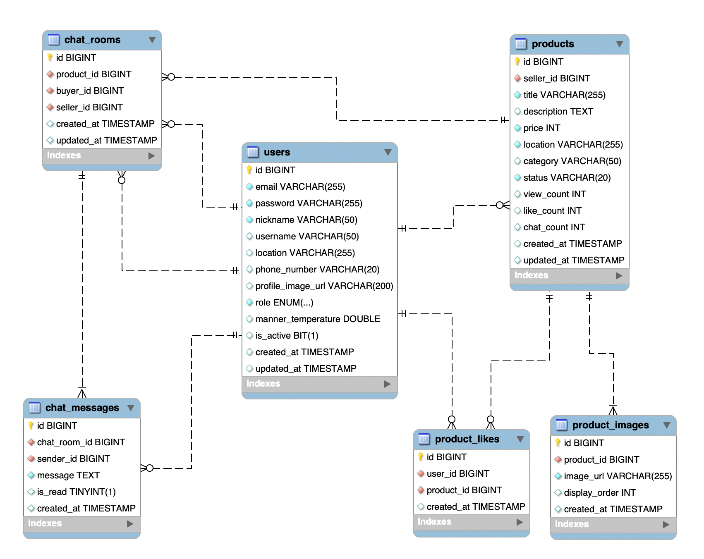

# 🥕 당근마켓 클론 프로젝트

Spring Boot + MySQL 기반 중고거래 플랫폼



## 📚 목차
- [기술 스택](#기술-스택)
- [주요 기능](#주요-기능)
- [빠른 시작](#빠른-시작)
- [API 문서](#api-문서)
- [프로젝트 구조](#프로젝트-구조)
- [개발 문서](#개발-문서)

## 🛠 기술 스택

### Backend
- **Java 17** (GraalVM)
- **Spring Boot 3.2.0**
  - Spring Security (JWT 인증)
  - Spring Data JPA
  - Spring Web
- **MySQL 8.0+**

### Frontend
- **Thymeleaf** (템플릿 엔진)
- **Tailwind CSS**
- **Vanilla JavaScript**

### 보안
- **JWT** (JSON Web Token)
  - Stateless 인증
  - HMAC SHA-512 서명
  - 토큰 만료 자동 검증
- **BCrypt** 비밀번호 암호화
- **CORS** 설정

### 기타
- **Lombok** (보일러플레이트 제거)
- **SpringDoc** (Swagger UI)
- **Gradle 8.14**

## ✨ 주요 기능

### 1. 인증 및 사용자 관리
- ✅ 회원가입 (유효성 검증)
- ✅ 로그인 (JWT 발급)
- ✅ 비밀번호 암호화 (BCrypt)
- ✅ 토큰 만료 시 자동 모달 표시 및 리다이렉트
- ✅ 프론트엔드 JWT 만료 검증

### 2. 상품 관리
- ✅ 상품 등록/수정/삭제
- ✅ 상품 목록 조회 (페이징)
- ✅ 상품 상세 조회
- ✅ 키워드 검색
- ✅ 지역별 필터링
- ✅ 좋아요 기능
- ✅ 조회수 자동 증가

### 3. 채팅 (Entity 준비 완료)
- 📝 1:1 채팅방 엔티티
- 📝 채팅 메시지 엔티티
- 📝 읽음 상태 관리

## 🚀 빠른 시작

### 사전 요구사항
- Java 17 이상
- MySQL 8.0 이상
- Gradle 8.14 (또는 Wrapper 사용)

### 1. 저장소 클론
```bash
git clone https://github.com/your-repo/carrot-market-clone.git
cd carrot-market-clone
```

### 2. 데이터베이스 설정
```bash
# MySQL 접속
mysql -u root -p

# 데이터베이스 생성
CREATE DATABASE carrot_market CHARACTER SET utf8mb4 COLLATE utf8mb4_unicode_ci;

# 또는 schema.sql 실행
mysql -u root -p < src/main/resources/schema.sql
```

### 3. JWT Secret Key 설정 (프로덕션 환경)
```bash
# 강력한 Secret Key 생성
openssl rand -base64 64

# 환경변수 설정
export JWT_SECRET="생성된_키"
export JWT_EXPIRATION="3600000"  # 1시간 (밀리초)
```

### 4. application.yml 설정
```yaml
spring:
  datasource:
    url: jdbc:mysql://localhost:3306/carrot_market
    username: root
    password: your_password  # 본인의 비밀번호로 변경

jwt:
  secret: ${JWT_SECRET:기본값}
  expiration: ${JWT_EXPIRATION:3600000}
```

### 5. 실행
```bash
# Gradle로 실행
./gradlew bootRun

# 또는 JAR 빌드 후 실행
./gradlew clean build
java -jar build/libs/carrot-market-clone-0.0.1-SNAPSHOT.jar
```

### 6. 접속
- **웹 애플리케이션**: http://localhost:8080
- **API 문서**: http://localhost:8080/swagger-ui.html

## 📖 API 문서

서버 실행 후 Swagger UI에서 확인할 수 있습니다.

### 인증 API (`/api/auth`)
| Method | Endpoint | 설명 | 인증 필요 |
|--------|----------|------|-----------|
| POST | `/api/auth/signup` | 회원가입 | ❌ |
| POST | `/api/auth/login` | 로그인 (JWT 발급) | ❌ |
| GET | `/api/auth/me` | 내 정보 조회 | ✅ |

### 상품 API (`/api/products`)
| Method | Endpoint | 설명 | 인증 필요 |
|--------|----------|------|-----------|
| GET | `/api/products` | 상품 목록 조회 | ❌ |
| GET | `/api/products/{id}` | 상품 상세 조회 | ❌ |
| POST | `/api/products` | 상품 등록 | ✅ |
| PUT | `/api/products/{id}` | 상품 수정 | ✅ |
| DELETE | `/api/products/{id}` | 상품 삭제 | ✅ |
| GET | `/api/products/search` | 키워드 검색 | ❌ |
| GET | `/api/products/location` | 지역별 검색 | ❌ |
| POST | `/api/products/{id}/like` | 좋아요 추가 | ✅ |
| DELETE | `/api/products/{id}/like` | 좋아요 취소 | ✅ |
| GET | `/api/products/my-products` | 내 상품 조회 | ✅ |
| GET | `/api/products/liked` | 관심 상품 조회 | ✅ |

## 📁 프로젝트 구조

```
src/main/java/com/carrot/market/
├── config/
│   ├── SecurityConfig.java          # Spring Security 설정
│   ├── SwaggerConfig.java           # Swagger 설정
│   └── WebConfig.java                # CORS 설정
├── controller/
│   ├── AuthController.java          # 인증 API
│   ├── ProductController.java       # 상품 API
│   └── WebController.java           # 웹 페이지
├── dto/
│   ├── JwtResponse.java             # JWT 응답
│   ├── LoginRequest.java            # 로그인 요청
│   ├── SignupRequest.java           # 회원가입 요청
│   ├── UserResponse.java            # 사용자 응답
│   ├── ProductRequest.java          # 상품 요청
│   └── ProductResponse.java         # 상품 응답
├── entity/
│   ├── User.java                    # 사용자 엔티티
│   ├── UserRole.java                # 사용자 권한 ENUM
│   ├── Product.java                 # 상품 엔티티
│   ├── ProductCategory.java         # 상품 카테고리 ENUM
│   ├── ProductStatus.java           # 상품 상태 ENUM
│   ├── ProductLike.java             # 좋아요 엔티티
│   ├── ChatRoom.java                # 채팅방 엔티티
│   └── ChatMessage.java             # 채팅 메시지 엔티티
├── exception/
│   ├── GlobalExceptionHandler.java  # 전역 예외 처리
│   ├── UsernameAlreadyExistsException.java
│   └── EmailAlreadyExistsException.java
├── repository/
│   ├── UserRepository.java
│   ├── ProductRepository.java
│   ├── ProductLikeRepository.java
│   ├── ChatRoomRepository.java
│   └── ChatMessageRepository.java
├── security/
│   ├── JwtAuthenticationFilter.java # JWT 검증 필터
│   └── UserDetailsService.java      # 사용자 인증 정보 로드
├── service/
│   ├── AuthService.java             # 인증 서비스
│   └── ProductService.java          # 상품 서비스
├── util/
│   └── JwtUtils.java                # JWT 유틸리티
└── CarrotMarketApplication.java     # 메인 클래스

src/main/resources/
├── application.yml                  # 애플리케이션 설정
├── schema.sql                       # DB 스키마
└── templates/                       # Thymeleaf 템플릿
    ├── layout.html                  # 공통 레이아웃
    ├── index.html                   # 메인 페이지
    ├── auth/
    │   ├── login.html
    │   └── signup.html
    └── products/
        ├── list.html
        ├── detail.html
        └── form.html
```

## 🔒 보안 기능

### JWT 인증
- **Stateless 인증**: 서버에 세션 저장 불필요
- **HMAC SHA-512**: 강력한 서명 알고리즘
- **토큰 만료**: 1시간 (설정 가능)
- **클라이언트 검증**: 페이지 로드 시 토큰 만료 확인
- **자동 모달**: 토큰 만료 시 사용자 안내 및 로그인 유도

### 비밀번호 보안
- **BCrypt 암호화**: Strength 10
- **강력한 정책**: 8자 이상, 대소문자/숫자/특수문자 필수

### 기타 보안 조치
- **User Enumeration 방어**: 일반적 에러 메시지
- **CORS 설정**: Origin 제한
- **계정 비활성화**: isActive 필드
- **환경변수**: JWT Secret Key 관리

## 📚 개발 문서

프로젝트의 이론과 구현 방법을 상세히 설명합니다.

- **[JWT 이론](./JWT이론.md)** - JWT 핵심 개념, 구조, 보안
- **[JWT 사용법](./JWT사용법.md)** - 프로젝트의 JWT 인증 흐름
- **[Spring Security 이론](./SpringSecurity이론.md)** - Spring Security 아키텍처

## 🎯 향후 개발 계획

### 우선순위 높음
- [ ] WebSocket 실시간 채팅 구현
- [ ] 이미지 업로드 (AWS S3 또는 로컬)
- [ ] Refresh Token 패턴 구현
- [ ] Rate Limiting (Brute Force 방어)

### 우선순위 중간
- [ ] 알림 기능 (SSE 또는 WebSocket)
- [ ] 사용자 프로필 관리
- [ ] 거래 후기 시스템
- [ ] 비밀번호 재설정 (이메일 인증)

### 우선순위 낮음
- [ ] 카테고리 관리
- [ ] 신고 기능
- [ ] 관리자 대시보드
- [ ] 통계 및 분석

## 🐛 트러블슈팅

### Lombok 관련 오류
```
java.lang.ExceptionInInitializerError at lombok.javac.apt.LombokProcessor
```
**해결**: `gradle.properties`에 Java 17 경로 설정

### MySQL 연결 오류
```
Public Key Retrieval is not allowed
```
**해결**: JDBC URL에 `allowPublicKeyRetrieval=true` 추가

### JWT 토큰 검증 실패
- Secret Key 확인
- 토큰 만료 시간 확인 (기본 1시간)
- Authorization 헤더 형식: `Bearer {token}`

## 📄 라이선스

MIT License

## 🤝 기여

이슈와 풀 리퀘스트는 언제나 환영합니다!

1. Fork the Project
2. Create your Feature Branch (`git checkout -b feature/AmazingFeature`)
3. Commit your Changes (`git commit -m 'Add some AmazingFeature'`)
4. Push to the Branch (`git push origin feature/AmazingFeature`)
5. Open a Pull Request