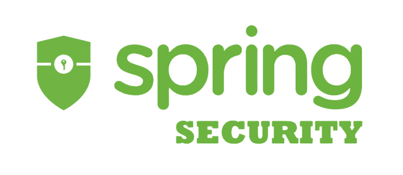
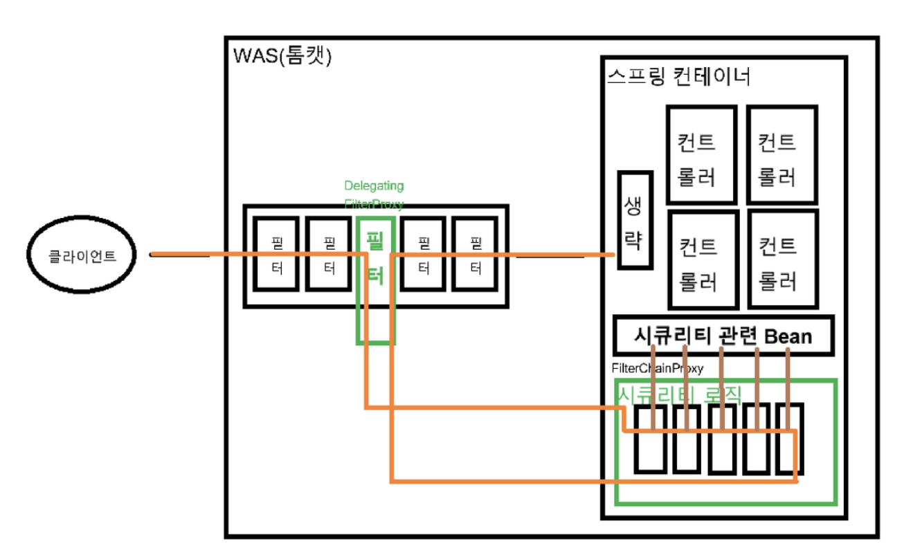
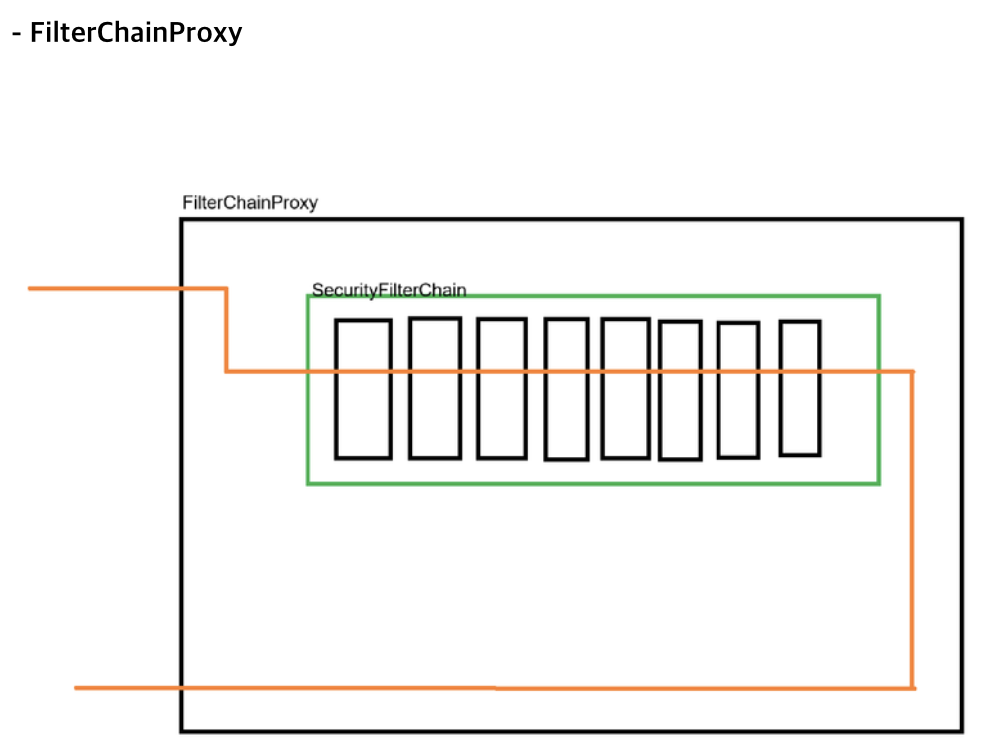

# Spring Security 핵심 구조



## 전체 아키텍처




## 동작 구조

### Spring Security 없을 때
```
클라이언트 요청 → WAS 필터 → 스프링 컨테이너 → 컨트롤러
```

### Spring Security 있을 때
```
클라이언트 요청
  ↓
WAS 필터
  ↓
DelegatingFilterProxy (Spring Security 진입점)
  ↓
FilterChainProxy
  ↓
SecurityFilterChain (개발자 구현)
  ├─ JwtAuthenticationFilter
  ├─ UsernamePasswordAuthenticationFilter
  └─ FilterSecurityInterceptor (권한 검사)
  ↓
컨트롤러
```

## 3계층 구조

| 계층 | 위치 | 역할 | 구현 |
|------|------|------|------|
| **DelegatingFilterProxy** | 서블릿 컨테이너 | Spring Bean 위임 | 자동 |
| **FilterChainProxy** | Spring 컨테이너 | SecurityFilterChain 관리 | 자동 |
| **SecurityFilterChain** | Spring 컨테이너 | 보안 규칙 정의 | **개발자** |

### 1. DelegatingFilterProxy
- WAS의 서블릿 필터로 등록
- Spring Bean `"springSecurityFilterChain"` 조회 후 위임
- 자동 생성

### 2. FilterChainProxy
- 여러 SecurityFilterChain 관리
- URL 패턴에 따라 적절한 체인 선택
- Bean 이름: `springSecurityFilterChain`
- 자동 생성

### 3. SecurityFilterChain
- **개발자가 직접 구현**
- 실제 보안 로직 정의
- 여러 개 생성 가능 (`@Order`로 우선순위 지정)

## 실제 구현

### 단일 SecurityFilterChain

```java
@Configuration
@EnableWebSecurity
@RequiredArgsConstructor
public class SecurityConfig {

    @Bean
    public SecurityFilterChain filterChain(HttpSecurity http) {
        http
            // CSRF 비활성화 (JWT 사용 시)
            .csrf(csrf -> csrf.disable())

            // CORS 설정
            .cors(cors -> cors.configurationSource(corsConfig()))

            // Stateless 세션
            .sessionManagement(session ->
                session.sessionCreationPolicy(SessionCreationPolicy.STATELESS))

            // URL 권한 설정
            .authorizeHttpRequests(auth -> auth
                .requestMatchers("/api/auth/**").permitAll()
                .requestMatchers("/api/products").permitAll()
                .anyRequest().authenticated()
            )

            // 커스텀 필터 추가
            .addFilterBefore(jwtAuthenticationFilter,
                UsernamePasswordAuthenticationFilter.class);

        return http.build();
    }
}
```

### 다중 SecurityFilterChain (URL 패턴별)

```java
@Configuration
@EnableWebSecurity
public class SecurityConfig {

    @Bean
    @Order(1)  // 우선순위
    public SecurityFilterChain apiChain(HttpSecurity http) {
        http
            .securityMatcher("/api/**")  // /api/** URL만
            .csrf(csrf -> csrf.disable())
            .sessionManagement(session ->
                session.sessionCreationPolicy(SessionCreationPolicy.STATELESS))
            .authorizeHttpRequests(auth -> auth
                .requestMatchers("/api/auth/**").permitAll()
                .anyRequest().authenticated()
            );
        return http.build();
    }

    @Bean
    @Order(2)
    public SecurityFilterChain webChain(HttpSecurity http) {
        http
            .authorizeHttpRequests(auth -> auth
                .requestMatchers("/", "/login").permitAll()
                .anyRequest().authenticated()
            )
            .formLogin(form -> form.loginPage("/login"));
        return http.build();
    }
}
```

## 주요 설정

| 설정 | 의미 | 사용 시기 |
|------|------|-----------|
| `csrf().disable()` | CSRF 보호 끄기 | REST API + JWT |
| `SessionCreationPolicy.STATELESS` | 세션 사용 안 함 | JWT 기반 인증 |
| `permitAll()` | 인증 없이 접근 | 공개 리소스 |
| `authenticated()` | 로그인 필수 | 보호된 리소스 |
| `hasRole("ADMIN")` | 특정 역할 필요 | 관리자 페이지 |
| `addFilterBefore()` | 기존 필터 앞에 추가 | 커스텀 인증 필터 |

## SecurityContextHolder

**인증 정보 저장소** (Spring Security가 자동 관리)

```
SecurityContextHolder (ThreadLocal)
  ↓
SecurityContext
  ↓
Authentication
  ├─ Principal (사용자 정보)
  ├─ Credentials (비밀번호)
  └─ Authorities (권한)
```

### Spring Security가 자동으로 하는 일
1. 요청 시작: SecurityContext 로드
2. 요청 처리: Authentication 접근 가능
3. 요청 종료: SecurityContext 초기화

### 개발자가 하는 일

**1. 컨트롤러/서비스에서 사용자 정보 조회**
```java
@GetMapping("/profile")
public String getProfile(Authentication authentication) {
    String username = authentication.getName();
    return "Profile: " + username;
}
```

**2. 커스텀 필터에서 인증 정보 설정** (JWT 필터)
```java
public class JwtAuthenticationFilter extends OncePerRequestFilter {
    @Override
    protected void doFilterInternal(...) {
        String token = extractToken(request);

        if (isValidToken(token)) {
            UserDetails user = getUserFromToken(token);

            UsernamePasswordAuthenticationToken auth =
                new UsernamePasswordAuthenticationToken(user, null,
                    user.getAuthorities());

            // 인증 정보 저장
            SecurityContextHolder.getContext().setAuthentication(auth);
        }

        filterChain.doFilter(request, response);
    }
}
```

## 요청 처리 흐름

### 성공 케이스 (JWT 포함)

```
1. [클라이언트]
   GET /api/products
   Authorization: Bearer eyJhbGc...

2. [Tomcat] → [DelegatingFilterProxy] → [FilterChainProxy]

3. [SecurityFilterChain 필터 체인]

4. [JwtAuthenticationFilter]
   - JWT 추출 및 검증
   - SecurityContext에 인증 정보 저장

5. [FilterSecurityInterceptor]
   - URL 매칭: "/api/products"
   - SecurityContext 확인: 인증 있음 ✓

6. [컨트롤러]
   비즈니스 로직 실행
```

### 실패 케이스 (JWT 없음)

```
1. [클라이언트]
   GET /api/products
   (JWT 없음)

...

4. [JwtAuthenticationFilter]
   - JWT 없음 → 인증 정보 설정 안 함

5. [FilterSecurityInterceptor]
   - SecurityContext: 인증 없음 ✗
   - AccessDeniedException 발생

6. [ExceptionTranslationFilter]
   - 401 Unauthorized 응답
```

## 역할 구분

### Spring Security가 자동으로 하는 것
- DelegatingFilterProxy 등록
- FilterChainProxy Bean 생성
- 기본 보안 필터 생성
- SecurityContextHolder 관리

### 개발자가 구현하는 것
- SecurityFilterChain (보안 규칙)
- 커스텀 필터 (JwtAuthenticationFilter)
- UserDetailsService
- AuthenticationProvider

## @EnableWebSecurity의 역할

```java
@Configuration
@EnableWebSecurity
public class SecurityConfig {
    // ...
}
```

**자동으로 활성화**:
1. DelegatingFilterProxy 서블릿 등록
2. FilterChainProxy Bean 생성
3. 기본 보안 설정 (로그인 페이지, CSRF 등)

## 디버깅

### application.yml
```yaml
logging:
  level:
    org.springframework.security: DEBUG
```

### 콘솔 출력
```
Security filter chain: [
  SecurityContextPersistenceFilter
  CorsFilter
  JwtAuthenticationFilter (커스텀)
  UsernamePasswordAuthenticationFilter
  FilterSecurityInterceptor
]
```

## 핵심 요약

1. **3계층 구조**
   - DelegatingFilterProxy (서블릿 ↔ Spring 연결)
   - FilterChainProxy (체인 관리)
   - SecurityFilterChain (보안 규칙) ← 개발자 구현

2. **SecurityFilterChain만 구현**
   - URL 권한 설정
   - 커스텀 필터 추가
   - CORS, CSRF, 세션 설정

3. **SecurityContext는 자동 관리**
   - Spring이 생성/초기화
   - 개발자는 필요 시 조회
   - 커스텀 필터에서만 직접 설정

4. **필터 체인 순서 중요**
   - JWT 필터는 UsernamePasswordAuthenticationFilter 앞에
   - 권한 검사는 FilterSecurityInterceptor에서